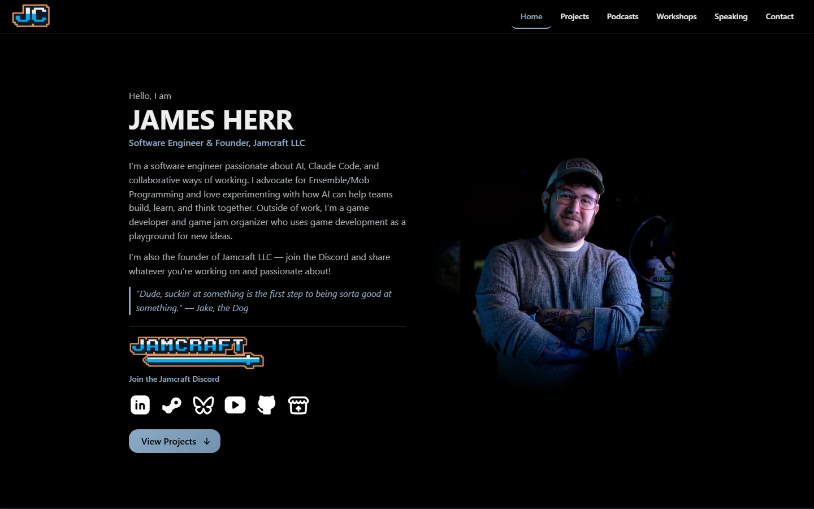
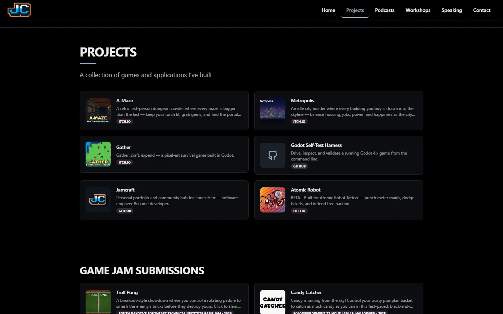
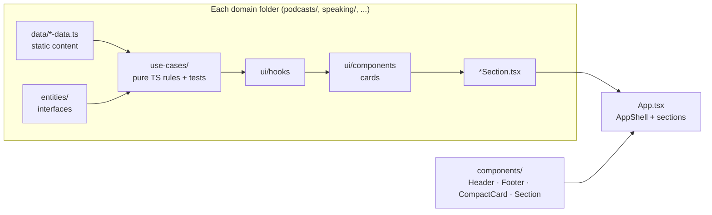
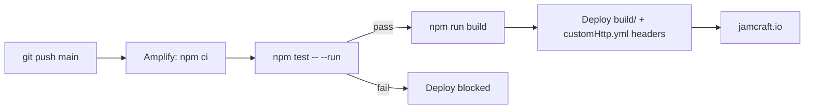

<div align="center">

<a href="https://jamcraft.io">
  
</a>

### Portfolio & community hub for James Herr — software engineer, game developer, founder of Jamcraft LLC

[](https://jamcraft.io)
[](./amplify.yml)
[](./jamcraft-app/src)
[](#-testing)
[](#-security)
[](./renovate.json)
[](https://github.com/SeveralHerr/JamcraftApp/commits/main)

[](https://react.dev/)
[](https://www.typescriptlang.org/)
[](https://vite.dev/)
[](https://mantine.dev/)
[](https://vitest.dev/)

**[🌐 Live site](https://jamcraft.io)** · **[💬 Discord](https://discord.gg/WVB8EwSNDG)** · **[🎮 itch.io](https://severalherr.itch.io/)** · **[💼 LinkedIn](https://www.linkedin.com/in/james-herr-63b85b1b3/)**

</div>

---

## 📸 Screenshots

<table>
  <tr>
    <td width="72%"></td>
    <td width="28%"></td>
  </tr>
  <tr>
    <td colspan="2"></td>
  </tr>
</table>

## ✨ Features

- **One scrolling page:** Home → Projects → Podcasts → Workshops → Speaking → Contact, with a scroll-spy header and deep links (`/#podcasts`; legacy `/projects` URLs redirect).
- **Compact card grids:** projects, game jam submissions, podcast appearances (▶ Watch / 🎧 Listen), workshops and talks, all keyboard-focusable links.
- **Polished dark theme:** pure black with a steel-blue accent, a portrait that fades into the background, entrance animations that play as each section scrolls into view.
- **Accessible:** one `<h1>`, a skip link, `aria-expanded` mobile menu, visible focus rings, and reduced-motion support.
- **Fast:** WebP portrait preloaded at high priority, lazy thumbnails, no loading spinners (static data renders on first paint).
- **Secure by default:** strict CSP and security headers, https-only external links, `noopener noreferrer` everywhere.

## 🧰 Tech stack

| Layer | Choice |
|---|---|
| UI | [React 19](https://react.dev/) + [Mantine 7](https://mantine.dev/) + [Tabler Icons](https://tabler.io/icons) |
| Language | TypeScript 5.7 (strict) |
| Build | [Vite 6](https://vite.dev/) → static `build/` |
| Tests | [Vitest 4](https://vitest.dev/) + React Testing Library + happy-dom |
| Hosting / CI | AWS Amplify ([`amplify.yml`](./amplify.yml)) + headers in [`customHttp.yml`](./customHttp.yml) |
| Dependencies | [Renovate](./renovate.json) for automated updates |

## 🚀 Getting started

Requires **Node.js 20+** and npm.

```bash
git clone https://github.com/SeveralHerr/JamcraftApp.git
cd JamcraftApp/jamcraft-app
npm ci
npm run dev        # http://localhost:5173
```

| Script | What it does |
|---|---|
| `npm run dev` | Vite dev server with hot reload |
| `npm test` | Vitest in watch mode (`npm test -- --run` for one pass) |
| `npm run test:coverage` | Coverage report (text + HTML in `coverage/`) |
| `npm run test:ui` | Vitest browser UI |
| `npm run lint` | ESLint |
| `npm run build` | Type-check (`tsc -b`) + production build to `build/` |
| `npm run preview` | Serve the production build locally |

## 🏗️ Architecture

The code follows **Screaming Architecture** (folders say what the site *does*) and **Clean Architecture** (business rules never import React).



```text
jamcraft-app/src/
├── portfolio/             # Hero: profile, bio, portrait, Discord invite
├── portfolio-projects/    # Projects grid
├── game-jam-submissions/  # Jam entries (rendered inside Projects)
├── podcasts/              # Podcast appearances
├── workshops/             # Workshops
├── speaking/              # Talks & panels
├── social-presence/       # Social links + https-only URL guard
├── components/            # Shared layout & UI (Header, MobileNav, Footer, CompactCard, Section, ...)
├── hooks/                 # useActiveSection (scroll-spy), useRevealOnScroll, useReducedMotion
├── config/                # Section registry, external links, cross-cutting tests
└── theme/                 # Design tokens + Mantine theme
```

## ✍️ Updating content

Content lives in plain TypeScript arrays. Add an object and the section updates itself.

| To add a… | Edit |
|---|---|
| Project (non-jam game, repo) | `src/portfolio-projects/data/portfolio-projects-data.ts` |
| Game jam entry | `src/game-jam-submissions/data/game-jam-submissions-data.ts` (include `jamYear`) |
| Podcast appearance | `src/podcasts/data/podcast-episodes-data.ts` |
| Workshop | `src/workshops/data/workshops-data.ts` |
| Talk / panel | `src/speaking/data/speaking-engagements-data.ts` |
| Bio | `src/portfolio/data/profile-data.ts` (`bio` is a list of paragraphs) |

Tests check every entry: unique ids, `https://` or `/assets/` URLs only, and newest-first ordering.

## 🧪 Testing

**202 tests across 36 files**, about 98% line coverage. Tests sit next to the code they cover (`*.test.ts[x]`).

- **Use cases:** sorting, filtering, label formatting, URL safety
- **Components:** rendering, link security, accessibility (heading levels, skip link, `aria-expanded`)
- **Cross-cutting:** every data URL is safe, security headers are present, `index.html` metadata, README links resolve

```bash
cd jamcraft-app && npm test -- --run && npm run test:coverage
```

## 🔒 Security

- **HTTP headers** ([`customHttp.yml`](./customHttp.yml)): `Content-Security-Policy` (`script-src 'self'`, `frame-ancestors 'none'`), HSTS, `X-Frame-Options: DENY`, `nosniff`, `Referrer-Policy`, `Permissions-Policy`.
- **Links:** external links must be `https:`; anything else renders as plain text.
- **Supply chain:** `npm audit` is clean, Renovate keeps dependencies current, and production builds ship without source maps.

## 🚢 Deployment



Every push to `main` is tested and deployed automatically. A failing test blocks the release.

## 🤖 Working with Claude Code

This repo ships its own agent tooling:

- [`.claude/CLAUDE.md`](.claude/CLAUDE.md): full technical guide and working agreements
- [`.claude/skills/validate-jamcraft-site`](.claude/skills/validate-jamcraft-site/SKILL.md): screenshot + accessibility + CSP validation loop
- [`.claude/mcp/viewport-screenshot`](.claude/mcp/viewport-screenshot/server.mjs): exact-viewport screenshots via headless Chrome (enabled in [`.mcp.json`](./.mcp.json))

## 📬 Contact

- **LinkedIn:** [James Herr](https://www.linkedin.com/in/james-herr-63b85b1b3/) (the best way to reach me)
- **Community:** [Jamcraft Discord](https://discord.gg/WVB8EwSNDG)
- **Games:** [severalherr.itch.io](https://severalherr.itch.io/)

<div align="center"><sub>© 2026 James Herr · Jamcraft LLC</sub></div>
